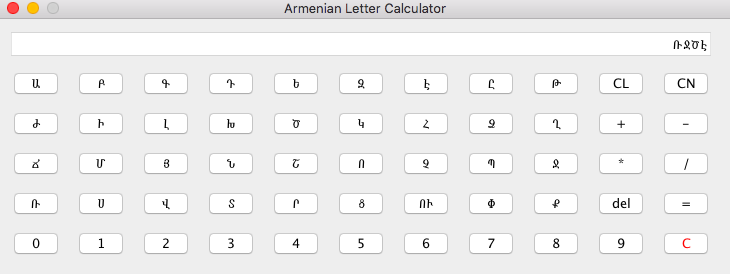

# Armenian letter calculator
Armenian letter calculator is a small desktop application for converting an Armenian medieval numbering system to a decimal system and the opposite written by java. The functionality of a simple calculator is included in the application as well.

<p align="center">

</p>

## Setup
(1) Change directory into the root of the project:
```sh
cd armLetterCalculator
```

(2) Compile the source code and keep the bytecode in the **target** folder:
```sh
javac -d target src/calculator/*.java
```

(3) Create jar artifact:
```sh
cp -r src/META-INF target/
cd target
mkdir artifact
jar cfvm artifact/calculator.jar META-INF/MANIFEST.MF calculator/*.class
```

(4) Run the calculator:
```sh
cd artifact
java -jar calculator.jar
```

## Usage
To Do

## License
Copyright © 2016, [Ara Gasparyan](https://aragasparyan.com).
Released under the [MIT License](https://opensource.org/licenses/MIT).